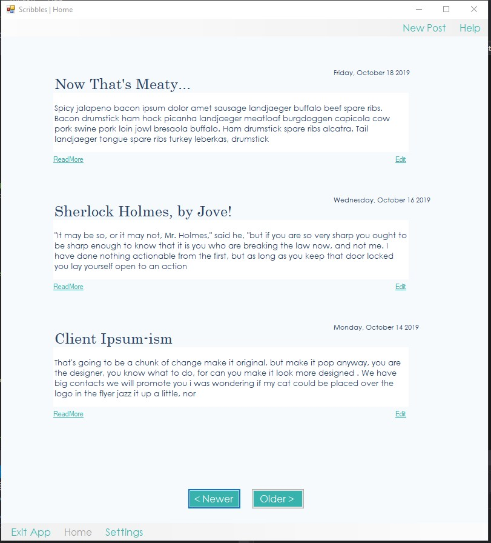
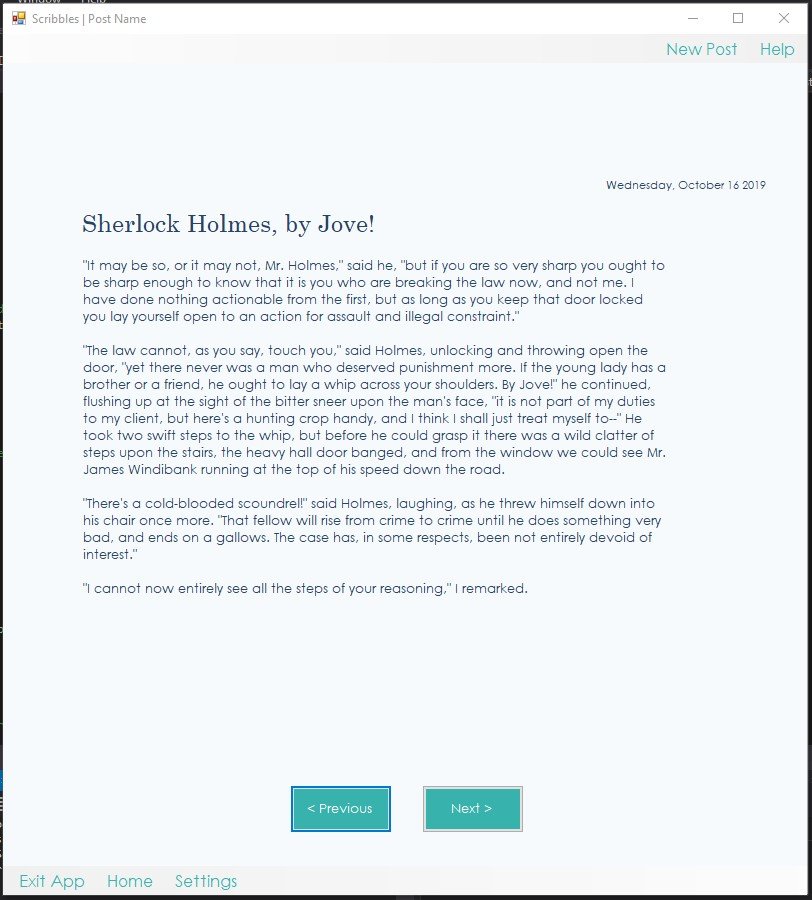
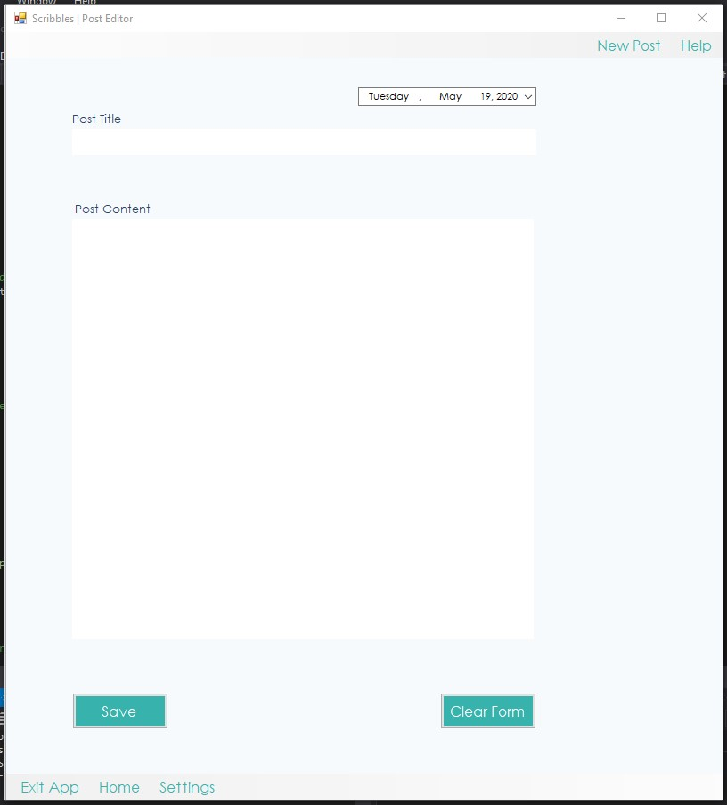
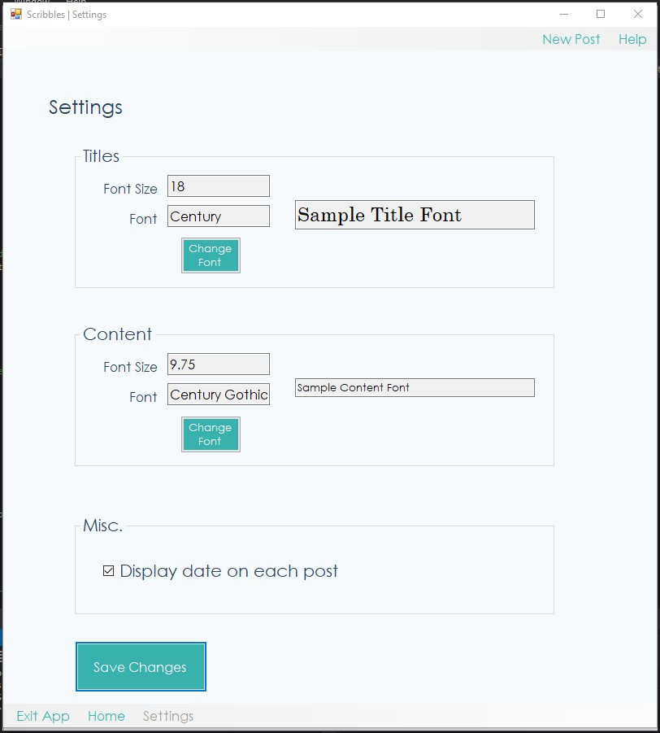
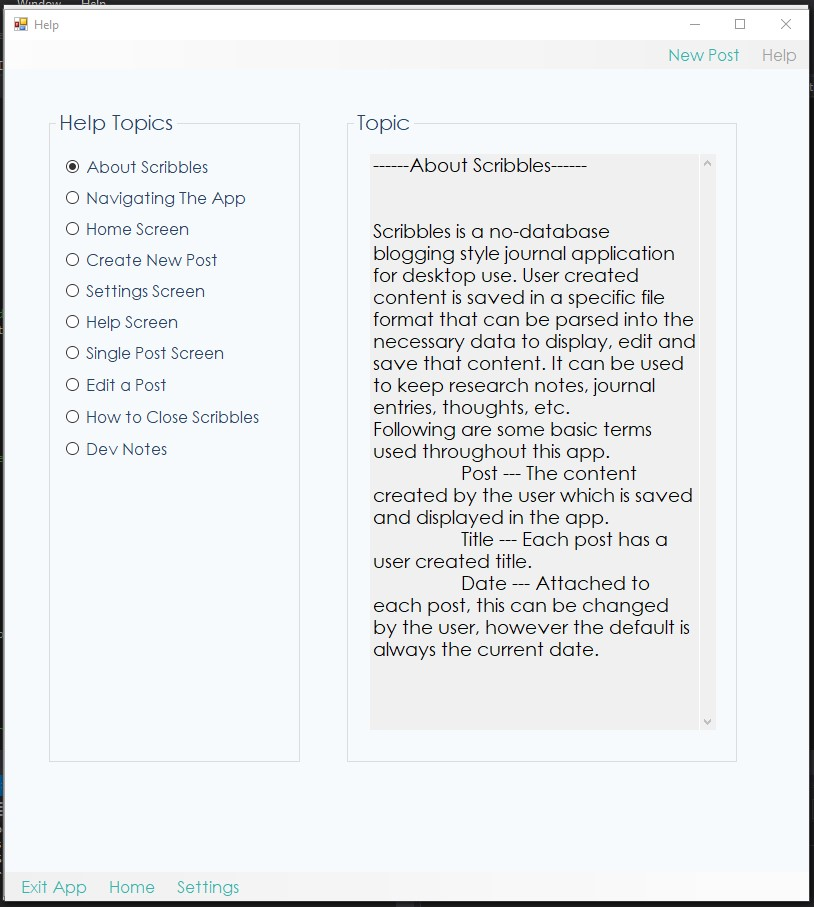

# Scribbles

## Desktop only blogging app for WinForms, no database needed.

### Overview

**Scribbles** is an end of semester project for **Programming II**

This is a flat file based blogging app that only lives on your desktop. 
It includes some limited formatting for posts, help files built-in, and
options to edit a post after it has been published.

*Scribbles - Home Screen*

I created a *composite control* for the post excerpts which appear in the home screen.
The control includes post title, excerpt, and "Read More" link.

---

*Scribbles - Single Post Page*

The posts are saved as simple text files, all the post meta info is parsed
out during the Read Loop. Each post becomes an object of the Post class, and the associated
info becomes its properties.

---

*Scribbles - New Post*

New posts are entered into the editor. On clicking "Save" the post object and all it's properties
are saved as strings to a delimeted file on the hard drive.

---

*Scribbles - Settings*

The settings screen allows for some customization of post and title appearance. These settings are also saved to a file
 and read to memory on each screen change as well as on initialization of the app.
 
 ---

*Scribbles - Help*

The documentation is built into the app. Selecting a topic from the list will display the information in the large text area.

---
*When cloning this project, be sure the ctlPostExcerptLib is included in the solution. This is a custom
control that allows post excerpts to fill the Home screen.*
